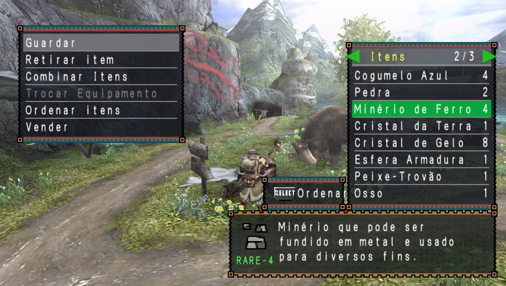
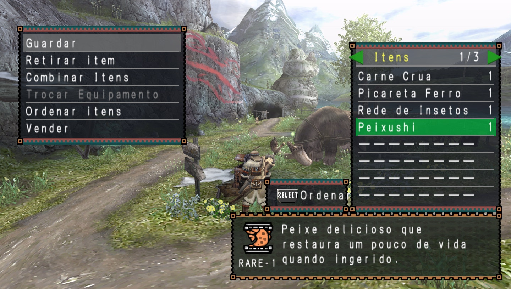
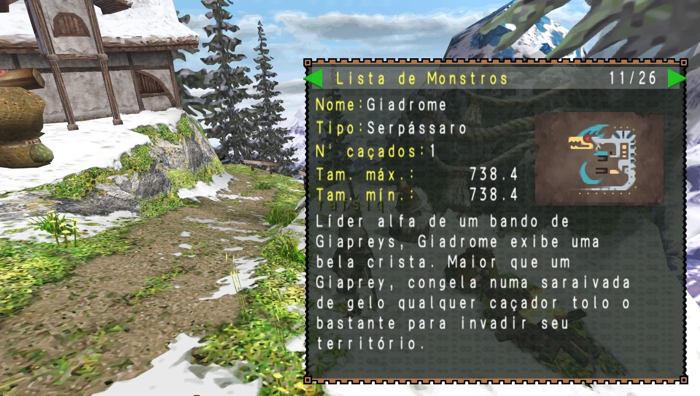
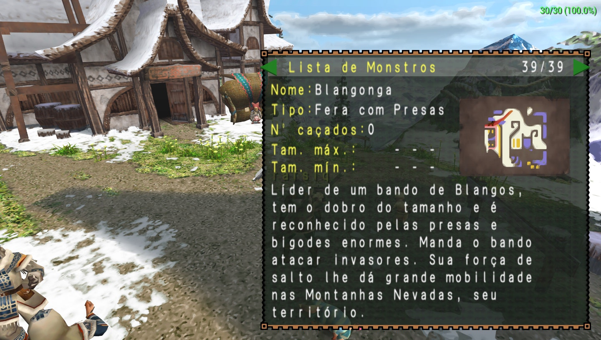
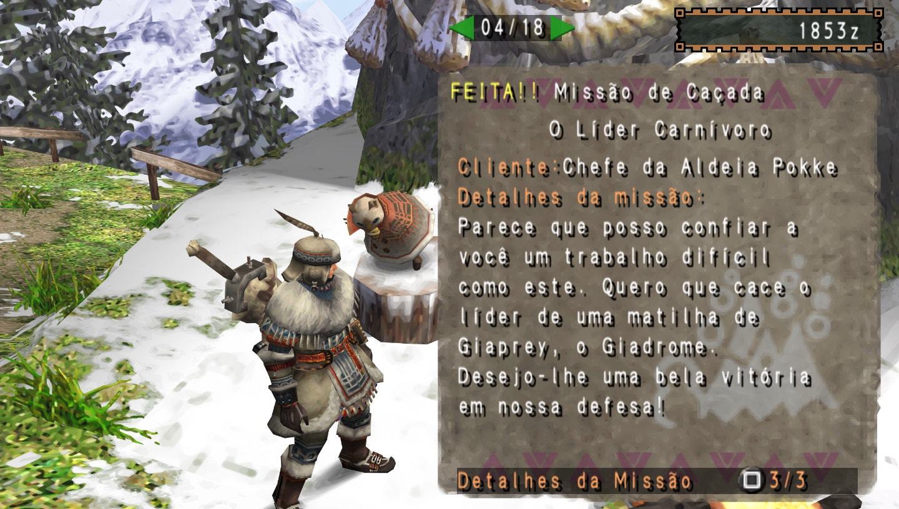
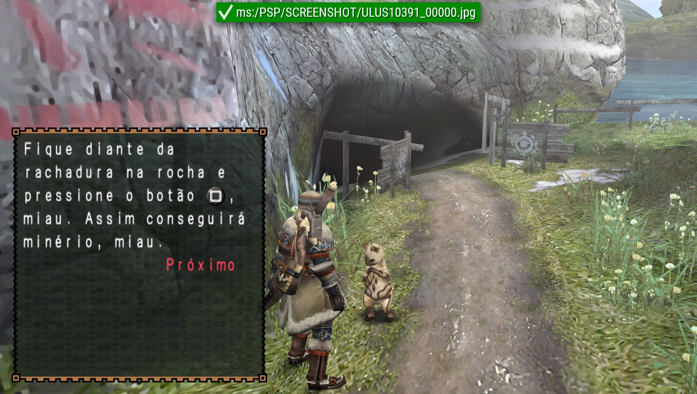

  

# Monster Hunter Freedom Unite — Tradução PT-BR

Patch de tradução não oficial de **Monster Hunter Freedom Unite** para português do Brasil.

Esta distribuição contém somente as diferenças produzidas pela tradução. Nenhuma ISO, ROM ou outro arquivo completo do jogo é fornecido.

A tradução toma como referência a terminologia oficial em português do Brasil dos jogos mais recentes da série *Monster Hunter*, com adaptações ao contexto de *Freedom Unite* e às limitações de espaço do jogo original.

## Conteúdo da tradução

- Textos de menus, itens e descrições;
- armas e armaduras permanecem com os nomes originais e as descrições traduzidas;
- missões, objetivos e resultados;
- diálogos, tutoriais e textos de ajuda;
- textos de interface e elementos gráficos localizados;
- padronização terminológica em português do Brasil.

## Imagens da tradução

  
  

  
  

  
  

## Versão do patch

**v1.0**, gerada em 08/10/2026.

## Requisitos

- Uma cópia própria da edição americana de *Monster Hunter Freedom Unite* para PSP, versão 1.01.
- Um programa compatível com patches Xdelta 3, obtido pelo próprio usuário.
- Aproximadamente 887 MB livres para a nova ISO.

### ISO base

| Propriedade | Valor |
| --- | --- |
| Edição | USA (En,Fr,De,Es,It), v1.01 |
| ID | `ULUS-10391` |
| Tamanho | 886.702.080 bytes |
| SHA-256 | `4f5687a1f4afd1df52019e66831ecd05ca5b6b4d876832d56fbc1f000d74a05e` |

Outras regiões, versões, imagens modificadas ou arquivos compactados não são compatíveis.

## Como instalar

1. Baixe `Monster-Hunter-Freedom-Unite-PTBR-v1.0.xdelta` da pasta [patches](patches) ou da [Release v1.0](https://github.com/rafsiq/monster-hunter-freedom-unite-ptbr/releases/tag/v1.0).
2. Instale ou baixe um aplicador compatível com Xdelta 3.
3. Selecione sua ISO base como arquivo de origem.
4. Selecione o arquivo `.xdelta` baixado como patch.
5. Escolha `Monster Hunter Freedom Unite (PT-BR) v1.0.iso` como arquivo de saída.

Confirme os hashes informados abaixo antes de jogar. Preserve a ISO original.

## Resultado esperado

| Propriedade | Valor |
| --- | --- |
| Nome sugerido | `Monster Hunter Freedom Unite (PT-BR) v1.0.iso` |
| Tamanho | 886.702.080 bytes |
| SHA-256 | `8d2a9c6dc1a28799424d58cfd0bbea3f61a5dbe03375e7a14185ccf3ea991cee` |

O patch `.xdelta` possui SHA-256 `50169ad3a9e03aee94a881d8dbf7b19564a4f49f8c3d81a81d7541d6d8cbf12a`. Consulte também [CHECKSUMS.md](CHECKSUMS.md).

## Problemas conhecidos

Apesar das verificações técnicas, podem existir textos longos, quebras de linha ou caracteres que precisem de ajustes de apresentação.

Ao encontrar um problema, abra uma issue e informe o local do jogo, o texto exibido, o texto esperado e, se possível, inclua uma captura de tela.

## Aviso legal

Este é um projeto de fãs, gratuito e sem fins lucrativos. Não possui vínculo, autorização ou associação com Capcom, Sony Interactive Entertainment ou qualquer outra detentora de direitos relacionada ao jogo.

*Monster Hunter*, seus nomes, marcas, personagens, imagens e demais elementos pertencem aos respectivos titulares. Este repositório e seus pacotes de distribuição não contêm a ISO completa do jogo.

O patch deve ser aplicado somente a uma cópia obtida legalmente pelo próprio usuário. Não solicite nem compartilhe links para ISOs, ROMs ou outros conteúdos protegidos nas issues, discussões ou demais canais do projeto.

Nenhum executável de aplicação é incluído. O usuário é responsável por obter uma ferramenta compatível com Xdelta 3 de uma fonte de sua confiança.
